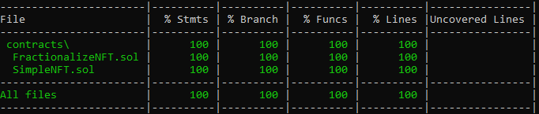

# NFT Fractional Ownership Protocol

This project demonstrates a basic NFT fractional ownership protocol.

## Tests coverage


## FractionalizeNFT

The contract allows you to deposit, fractionalize NFT and then sell/buy the fractions.

### **deposit**
Deposit NFT, before the transfer should be approved for the contract address.

### **fractionalize**
Fractionalize already deposited NFT.

### **sell**
Publish for selling ERC20 fractions.

### **depositFractionalizeSell**
Execute all three the above operations in single call.

### **buy**
Buy ERC20 fractions.

### **Implementation details**
All deposited NFTs are stored inside ```mapping(address => mapping(uint => Token)) usersTokens``` first key is the address of the NFT owner and second is unique token id that is generated by ```getUniqueTokenId``` function. Later on when we sell/buy tokens we will use the unique token id to refer to specific token.

The Token structure contains all necesssary properties for fractionalization and selling the tokens.

```
    struct Token {
        bool initialized;
        address tokenContract;
        uint tokenId;
        bool fractionalized;
        ERC20 fractionsContract;
        uint weiPricePerToken;
        bool soldOut;
    }
```

```initialized``` - used to check if token was deposited for this user already.  
```tokenContract``` - NFT token contract address.  
```tokenId``` - NFT token id.  
```fractionalized``` - used to check if token was fractionalized.  
```fractionsContract``` - Contract that will be initialized during fractionalization and will hold supply of ERC20 tokens (NFT fractions) for selling.  
```weiPricePerToken``` - price per ERC20 token in wei.  
```soldOut``` - used to check if this token fractions were already sold.

<br/>
<br/>

```
mapping(uint => address) tokensForSale;
```

```tokensForSale``` is like cursor that is used to find the actual token in the ```usersTokens``` mapping.
When ```sell``` is executed for given token, if all conditions are met, entry for it will be created in ```tokensForSale```.  
During ```buy``` execution if all tokens are sold out, ```soldOut``` property will be set to ```true``` and entry will be removed from ```tokensForSale```. 

## SimpleNFT

Simple contract that generates ERC721 and is used only for testing the FractionalizeNFT contract.